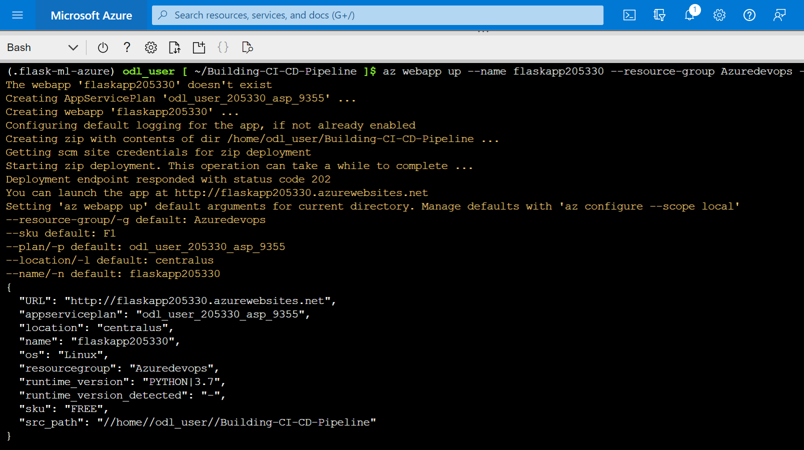

# Overview

In this project, we build a Github repository and use the scaffolding that with help us with deploying Flask ML API and perform Continuous Integration and Continuous Delivery. 
* We perform continuous integration using Github Actions that performs linting, testing and dependencies installation. 
* We integrate our project with Azure Pipeline to allow Continuous delivery to Azure App Service.

## Project Plan
Trello board and spreadsheet for project planning and execution.

* A link to a Trello board for the project [link](https://trello.com/invite/b/0O5wVZPH/9804074e7757daa5e631d85b9bd6aa57/building-ci-cd-pipeline)
* Spreadsheet that includes the original and final project plan [link](https://docs.google.com/spreadsheets/d/1G2UlwSD3HVO32IbAr77t-I1oMyIP3ido7AKpit3aojg/edit#gid=0)

## Instructions

  
* Architectural Diagram


### Instructions for running the Python project

We need to create a self/hosted agent a new linux VM that will build and deploy the code

* Login to Azure Portal and Azure Devops. Set up the Azure DevOps account and create organization and project using the following links
    * https://portal.azure.com/
    * https://dev.azure.com/ 

* Set up a new service connection via Azure Resource Manager and Service principal (manual).

* Create a repository in Github and copy the starter code
* Enable Azure Pipeline in the project
* Launch an Azure Cloud Shell environment and create ssh-keys. Upload these keys to your Github account
* Login to Azure Cloud shell and clone the repository

* Enable Github Actions and copy the yml code with scaffolding
* Verify remote test pass in Github Actions

* Test the repository locally by creating a virtual environment and running make all in Azure Cloud Shell

* Deploy the app using Azure app service by using the following command in Azure Cloud Shell
```bash
# Provide the web app name as a globally unique value. 
az webapp up --name <Your_unique_app_name> --resource-group Azuredevops --runtime "PYTHON:3.7"
```

* Verify that the app is run by going to the link
```bash
https://<Your_unique_app_name>.azurewebsites.net/
```

* Update make_predict_azure_app.sh file with the web link and generate predictions by running the following commands
```bash
chmod +x ./make_predict_azure_app.sh
./make_predict_azure_app.sh
```

* Create a self host agent pool in Azure devops

* Create a Linux VM and configure the Linux VM in Azure Cloud Shell as an Azure DevOps Build Agent

* Add a new agent to agent pool

* Create a pipeline in the Azure project and update the azure-pipelines.yml

* Run the pipeline

* Output of streamed log files from deployed application

 

## Enhancements
* Improvement in the app GUI and functionality
* Performance validation of the webapp via a load test, etc.

## Demo 


